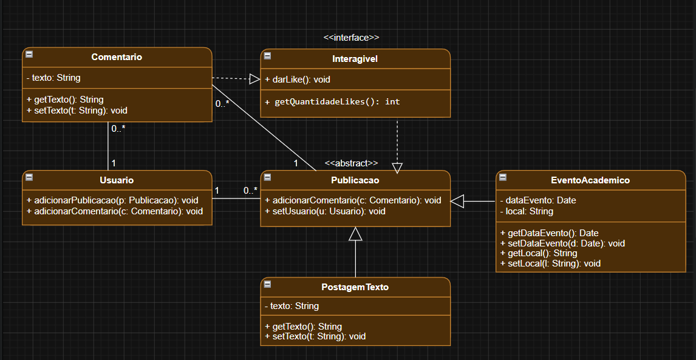

<p align="center">
  <h1 align="center">🎓 IntegraUFG</h1>
  <p align="center">
    Plataforma de rede social acadêmica para a comunidade da Universidade Federal de Goiás
  </p>
  <p align="center">
    
    
    
    
    
  </p>
</p>

---

## 📋 Sobre o Projeto

**IntegraUFG** é uma plataforma de rede social acadêmica desenvolvida para a comunidade da Universidade Federal de Goiás. A aplicação combina elementos de **fórum acadêmico**, **rede social** e **espaço comunitário universitário**, oferecendo um ambiente onde estudantes podem colaborar, compartilhar conhecimento e se conectar.

O projeto foi construído com uma arquitetura **cliente-servidor**, utilizando **Spring Boot** como backend REST API e **JavaFX** como interface gráfica desktop.

---

## ✨ Funcionalidades

### 👤 Gestão de Usuários
- Cadastro com e-mail institucional e curso
- Login com autenticação via senha criptografada (BCrypt)
- Visualização e edição de perfil
- Sistema de papéis (administrador / usuário comum)

### 📝 Publicações
- Criação de **postagens de texto** no feed
- Criação de **eventos acadêmicos** com título, descrição, data e local
- Feed com scroll infinito exibindo todas as publicações
- Curtidas em publicações

### 💬 Interações Sociais
- Comentários em publicações
- Sistema de curtidas em publicações e comentários
- Feed em tempo real com atualizações

### 📅 Eventos Acadêmicos
- Criação e divulgação de eventos com data e local
- Visualização de eventos no feed principal

---

## 🏗️ Arquitetura

O projeto segue uma arquitetura **MVC (Model-View-Controller)** com separação clara entre camadas:

```
┌──────────────────────────────────────────────────────┐
│                    CLIENTE (JavaFX)                   │
│  ┌──────────┐  ┌────────────┐  ┌──────────────────┐ │
│  │   Views   │  │ Controllers│  │  Client (HTTP)   │ │
│  │  (FXML)   │──│   (View)   │──│  UsuarioClient   │ │
│  │           │  │            │  │  PublicacaoClient │ │
│  └──────────┘  └────────────┘  │  InteracaoClient │ │
│                                 └────────┬─────────┘ │
└─────────────────────────────────────────┬────────────┘
                                          │ REST API
┌─────────────────────────────────────────┴────────────┐
│                  SERVIDOR (Spring Boot)              │
│  ┌──────────────┐  ┌──────────┐  ┌────────────────┐ │
│  │  Controllers  │──│ Services │──│  Repositories  │ │
│  │  (REST API)   │  │          │  │   (JPA/ORM)    │ │
│  └──────────────┘  └──────────┘  └───────┬────────┘ │
└──────────────────────────────────────────┬───────────┘
                                           │
                                    ┌──────┴──────┐
                                    │ PostgreSQL  │
                                    │  (Supabase) │
                                    └─────────────┘
```

---

## 📐 Diagrama UML de Classes (Modelo de Domínio)

<p align="center">
  
</p>

O modelo de domínio é composto por:

| Classe | Tipo | Descrição |
|---|---|---|
| `Interagivel` | Interface | Define o contrato de curtidas (`curtir()`, `getTotalCurtidas()`) |
| `Publicacao` | Classe Abstrata | Base para todos os tipos de publicação (autor, data, curtidas, comentários) |
| `PostagemTexto` | Entidade | Publicação de texto simples |
| `EventoAcademico` | Entidade | Publicação de evento com título, descrição, data e local |
| `Comentario` | Entidade | Comentário vinculado a uma publicação |
| `Usuario` | Entidade | Usuário do sistema com nome, e-mail institucional, senha e curso |

---

## 🛠️ Tecnologias Utilizadas

| Camada | Tecnologia |
|---|---|
| **Linguagem** | Java 21 |
| **Backend** | Spring Boot 3.5 |
| **Persistência** | Spring Data JPA / Hibernate |
| **Segurança** | Spring Security + BCrypt |
| **Banco de Dados** | PostgreSQL (hospedado no Supabase) |
| **Frontend Desktop** | JavaFX 21 + FXML + CSS |
| **Build** | Apache Maven |
| **Padrão Arquitetural** | MVC + REST API |

---

## 📁 Estrutura do Projeto

```
IntegraUFG/
├── pom.xml                         # Configuração Maven e dependências
├── UML-img.png                     # Diagrama UML de classes
├── UML_IntegraUFG.drawio           # Diagrama UML editável (draw.io)
└── src/
    ├── main/
    │   ├── java/ufg/IntegraUFG/
    │   │   ├── IntegraUfgApplication.java   # Classe principal Spring Boot
    │   │   ├── model/                       # Entidades JPA
    │   │   │   ├── Interagivel.java         # Interface de interação
    │   │   │   ├── Publicacao.java          # Classe abstrata de publicação
    │   │   │   ├── PostagemTexto.java       # Postagem de texto
    │   │   │   ├── EventoAcademico.java     # Evento acadêmico
    │   │   │   ├── Comentario.java          # Comentário
    │   │   │   └── Usuario.java             # Usuário
    │   │   ├── repository/                  # Repositórios JPA
    │   │   ├── service/                     # Lógica de negócio
    │   │   ├── controller/                  # Controllers REST API
    │   │   ├── dto/                         # Data Transfer Objects
    │   │   │   ├── request/                 # DTOs de requisição
    │   │   │   └── response/                # DTOs de resposta
    │   │   ├── config/                      # Configurações (Security)
    │   │   ├── client/                      # Clients HTTP (JavaFX → API)
    │   │   └── view/                        # Interface gráfica JavaFX
    │   │       ├── IntegraUfgApp.java       # App JavaFX principal
    │   │       ├── Launcher.java            # Launcher da aplicação
    │   │       ├── SessaoUsuario.java       # Sessão do usuário logado
    │   │       ├── TelaLoginController.java
    │   │       ├── TelaCadastroController.java
    │   │       ├── TelaFeedController.java
    │   │       ├── TelaPerfilController.java
    │   │       └── components/              # Componentes visuais reutilizáveis
    │   │           ├── PostCardComponent.java
    │   │           ├── EventoCardComponent.java
    │   │           └── ProfileFormComponent.java
    │   └── resources/
    │       ├── application.properties       # Configuração Spring Boot
    │       ├── style.css                    # Estilos da interface
    │       ├── Login.fxml                   # Tela de login
    │       ├── cadastro.fxml                # Tela de cadastro
    │       ├── feed.fxml                    # Tela do feed principal
    │       └── perfil.fxml                  # Tela de perfil
    └── test/                                # Testes
```

---

## 🚀 Como Executar

### Pré-requisitos

- **Java 21** ou superior ([download](https://jdk.java.net/21/))
- **Maven 3.9+** ([download](https://maven.apache.org/download.cgi))
- **PostgreSQL** (ou acesso ao banco Supabase configurado)

### Passos

1. **Clone o repositório:**
   ```bash
   git clone https://github.com/RonanAlecrim/IntegraUFG.git
   cd IntegraUFG
   ```


2. **Compile e execute o servidor (Spring Boot):**
   ```bash
   mvn spring-boot:run
   ```

4. **Execute o cliente (JavaFX):**
   
   Em outro terminal, execute a classe `Launcher.java`:
   ```bash
   mvn javafx:run
   ```
   Ou execute diretamente pela IDE (IntelliJ IDEA / Eclipse) a classe `Launcher.java`.

> **Nota:** O servidor Spring Boot precisa estar rodando antes de iniciar o cliente JavaFX, pois o cliente consome a API REST.

---

## 🖥️ Telas da Aplicação

| Tela | Descrição |
|---|---|
| **Login** | Autenticação com e-mail institucional e senha |
| **Cadastro** | Registro de novo usuário com dados acadêmicos |
| **Feed** | Timeline com postagens, eventos e criação de conteúdo |
| **Perfil** | Visualização e edição das informações do usuário |


